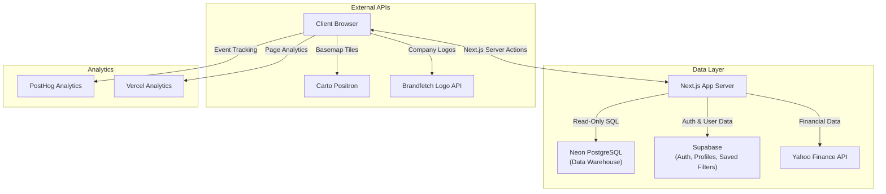

# Bamboo Reports By ResearchNXT

A modern Business Intelligence dashboard built with Next.js App Router, React, and TypeScript. The app delivers account, center, service, and prospect intelligence through rich filtering, data visualization, geospatial analytics, and export workflows.

[](https://vercel.com)
[](https://nextjs.org/)
[](https://react.dev/)
[](https://www.typescriptlang.org/)
[](https://tailwindcss.com/)
[](https://nodejs.org/)
[](https://supabase.com)
[](https://neon.tech/)
[](https://posthog.com/)
[](https://maplibre.org/)
[](LICENSE)

---

## Table of Contents

- [Overview](#overview)
- [Key Features](#key-features)
- [Architecture & Data Flow](#architecture--data-flow)
- [Tech Stack](#tech-stack)
- [Project Structure](#project-structure)
- [Getting Started](#getting-started)
- [Environment Variables](#environment-variables)
- [Authentication & Authorization](#authentication--authorization)
- [Database & Schema](#database--schema)
- [Analytics & Monitoring](#analytics--monitoring)
- [Deployment](#deployment)
- [Troubleshooting](#troubleshooting)
- [Documentation Reference](#documentation-reference)

---

## Overview

Bamboo Reports provides a unified view of business entities (**Accounts**, **Centers**, **Services**, **Functions**, **Tech**, and **Prospects**). The dashboard combines high-performance data grids with geospatial analytics and charting to empower decision-makers.

### Core Value Proposition
- **High Signal-to-Noise:** Designed for rapid filtering and drilling down into large datasets.
- **Geospatial Intelligence:** Visualize delivery center density with clustered markers and state-level choropleth maps.
- **Persistence:** Save complex filter configurations to the cloud (Supabase) for recurring reporting tasks.
- **Exportability:** Generate boardroom-ready Excel reports with multi-sheet support and company logos.
- **Real-Time Notifications:** Track recently updated accounts and table records with an in-app notification system.

---

## Key Features

### Dashboard and Insights
- **Smart Summary Cards:** Real-time filtered vs. total counts per entity.
- **Interactive Charts:** Highcharts donut charts and a technology treemap for categorical breakdowns (Country, Industry, Revenue, Headcount, Technology), plus a Recharts revenue trend chart in the Account details dialog.
- **Tabbed Navigation:** Switch between Accounts, Centers, Prospects, and Services tabs.
- **Deployment-Level Access Control:** Accounts, Centers, and Prospects can be enabled or disabled per deployment via `lib/config/dashboard-access.ts`.
- **Geospatial Analytics:**
  - MapLibre cluster map optimized for 5000+ center points over a keyless Carto basemap.
  - State-level choropleth map using local Survey of India administrative boundaries.

### Advanced Filtering Engine
- **Multi-Select Filters:** Country, Region, Industry, Category, Nature, Technology, Functions, and more.
- **Server-Side Filtering (#249):** Filters are translated to parameterized SQL on the server and the client reads paginated slices and pre-computed aggregates; no endpoint returns the whole dataset. See [Server-Mode Dashboard](documentation/backend/server-dashboard-mode.md).
- **Account Visibility Filter:** `ALL` / `GCCs` / `NON-GCCs` toggle (default `GCCs`) constrains tables, charts, and exports to the chosen account set, while summary cards still report the full universe.
- **Alias-Aware Account Search:** Global search and the account filter autocomplete match accounts by alternate names (short legal name, brand, abbreviation, flagship products, "currently known as") and show a "Known as" hint on alias matches.
- **Precision Slicing:** "Include" vs. "Exclude" toggle per filter group.
- **Range Sliders:** Revenue, Employee count, and Years in India sliders with logarithmic scaling.
- **Premium Filter Reveal:** Accounts and Centers support config-driven `Show More` premium filters via `lib/config/filters.ts`.
- **Saved Filters:** Persist complex filter sets to Supabase with Row-Level Security isolation.
- **Filter Sharing:** Share a saved filter with a specific teammate by email; the recipient gets read access to that one filter only.
- **Debounced Search:** 300ms debounce on keyword inputs to optimize performance.
- **Active Filter Count:** Visual badge indicator showing the number of applied filters.

### Data Management
- **Paginated Tables:** 50 items per page, optimized for performance with `React.memo`.
- **Row-Level Details:** Comprehensive tabbed dialog views for Accounts, Centers, and Prospects.
- **Type Safety:** Shared TypeScript definitions ensuring consistency from database to UI.

### Export and Integrations
- **Server-Side `.xlsx` Exports:** ExcelJS builds multi-sheet workbooks on the server against a full-schema `SELECT *`, so exports include every database column regardless of what the dashboard renders.
- **Filter-Aware:** The client sends account / center identifier lists (or, in server mode, the filter set itself) so filtered exports only include matching rows; unfiltered exports pull the full tables.
- **Audit Log + Re-Download:** Every export is archived to a private Supabase Storage bucket and logged in `public.user_exports` with IP, user-agent, filters snapshot, and row counts. Users re-download past exports from the **My exports** dialog via short-lived signed URLs.
- **Logo Integration:** Automated company logo fetching via the Brandfetch Logo API with monogram fallbacks.
- **Financial Data:** Stock information and financial metrics via Yahoo Finance integration.

> **Details:** See [User Exports & Audit Log](documentation/backend/user-exports.md) for the architecture, setup steps, and troubleshooting.

### Notifications
- **Recently Updated Accounts:** Tracks account-level changes with grouped notifications.
- **Recently Updated Records:** Table-level update summaries across all entities.
- **Unread Count Badge:** Bell icon with visual count indicator.
- **Feature Flag:** Toggle via `NEXT_PUBLIC_NOTIFICATIONS_ENABLED` environment variable.

### Personalization
- **Favorites:** Star any account, center, or prospect and revisit it from a dedicated list, private per user.
- **Recently Viewed History:** Automatic tracking of recently opened detail dialogs.
- **Guided Product Tour:** Auto-starting, replayable `driver.js` walkthrough for first-time users, with per-browser and per-account completion tracking.

> **Details:** See [Favorites & Filter Sharing](documentation/backend/favorites-and-filter-sharing.md) and [Product Tour](documentation/frontend/product-tour.md).

---

## Architecture & Data Flow

The application follows a **Server-First** data architecture with **Client-Side** interactivity.



### Data Fetching Strategy
1. **Initial Load:** The client fetches the full dashboard dataset from the `GET /api/dashboard` Route Handler, which wraps the underlying Server Action with an in-memory SWR cache and gzip compression.
2. **Filtering:** User actions update React state; client-side filtering and chart aggregation run locally for responsiveness.
3. **Route Handlers and Server Actions:** Warehouse reads go through `app/api/**` Route Handlers built on `lib/dashboard/filtering-sql.ts`; user-data operations use action files (`app/actions/saved-filters.ts`, `app/actions/financial.ts`, `app/actions/notifications.ts`, `app/actions/system.ts`).
4. **Runtime Behavior (#249):** Filters are translated to SQL on the server and the client reads paginated/aggregated slices from dedicated endpoints (`/api/dashboard/summary`, `/api/dashboard/facets`, `/api/dashboard/charts`, `/api/{accounts,centers,prospects}/query`, `/api/search`, `/api/centers/map`). Responses are cached in a two-tier cache (in-memory L1 + Upstash Redis L2) keyed on the filter state and purged by the ETL after each import. See [Server-Mode Dashboard](documentation/backend/server-dashboard-mode.md) and [Caching and Rate Limiting](documentation/backend/caching-and-rate-limiting.md).

---

## Tech Stack

For a comprehensive breakdown of every technology used in this project, see the **[Tech Stack Reference](documentation/tech-stack.md)**.

### Core Framework
| Technology | Version | Purpose |
|------------|---------|---------|
| **Next.js** | 16.2.x | App Router, Server Actions, Route Handlers, SSR |
| **React** | 19.2.x | Component Library, Hooks |
| **TypeScript** | 5.x | Strict Type Safety |

### UI and Styling
| Technology | Purpose |
|------------|---------|
| **Tailwind CSS 3.4** | Utility-first styling with custom animations |
| **shadcn/ui** | Accessible component primitives (Radix UI) |
| **Lucide React** | Consistent iconography |
| **next-themes** | Dark/Light mode support |
| **DM Sans** | Primary typeface (Google Fonts, variable) |

### Data Visualization
| Technology | Purpose |
|------------|---------|
| **Highcharts** | Donut charts for categorical breakdowns and the Technology treemap |
| **Recharts** | Revenue trend area chart in the Account details dialog |
| **MapLibre GL + Carto** | Cluster maps and state choropleth |

### Backend and Data
| Technology | Purpose |
|------------|---------|
| **Neon PostgreSQL** | Primary BI data warehouse (serverless, read-only) |
| **Supabase** | Authentication, user profiles, saved filters |
| **Yahoo Finance 2** | Stock and financial data integration |
| **ExcelJS** | Native `.xlsx` report generation |
| **Zod** | Schema validation for forms and inputs |

### Testing
| Technology | Purpose |
|------------|---------|
| **Vitest** | Fast unit and integration testing framework |
| **React Testing Library** | UI component testing |

### Analytics and Monitoring
| Technology | Purpose |
|------------|---------|
| **PostHog** | Product analytics and event tracking |
| **Vercel Analytics** | Page performance monitoring |

---

## Project Structure

```
bamboo-reports-nextjs/
├── app/                            # Next.js App Router
│   ├── (auth)/                     # Auth route group (signin, signup)
│   ├── actions/                    # Modular Server Actions
│   │   ├── data.ts                 # Core data fetching (accounts, centers, etc.)
│   │   ├── saved-filters.ts        # Saved filter CRUD operations
│   │   ├── financial.ts            # Financial data queries
│   │   ├── notifications.ts        # Notification logic
│   │   └── system.ts               # System diagnostics
│   ├── api/                        # Route Handlers
│   │   ├── dashboard/              # Cached dashboard payload + summary/facets/charts endpoints
│   │   ├── accounts/               # Paginated account query, autocomplete, detail, related
│   │   ├── centers/                # Paginated center query, detail, map data
│   │   ├── prospects/              # Paginated prospect query and detail
│   │   ├── search/                 # Server-side global search
│   │   ├── financials/             # Authed, rate-limited Yahoo Finance proxy
│   │   └── exports/                # Export generation, listing, and re-download
│   ├── actions.ts                  # Central server action re-exports
│   ├── layout.tsx                  # Root layout with providers
│   ├── page.tsx                    # Main dashboard entry point
│   └── providers.tsx               # Analytics providers (PostHog)
│
├── components/                     # React Components
│   ├── auth/                       # Authentication UI (signin/signup forms)
│   ├── cards/                      # Card component variants
│   ├── charts/                     # Recharts + Highcharts visualizations
│   ├── dashboard/                  # Summary cards and hero stats
│   ├── dialogs/                    # Detail views (Account, Center, Prospect)
│   ├── export/                     # Excel export workflow
│   ├── exports/                    # My exports dialog (audit log re-download)
│   ├── filters/                    # Sidebar filter UI and controls
│   ├── history/                    # Recently viewed history dialog
│   ├── layout/                     # Header and Footer
│   ├── maps/                       # MapLibre cluster + choropleth maps
│   ├── notifications/              # Notification bell dropdown
│   ├── search/                     # Global search with alias-aware matching
│   ├── states/                     # Loading and error state components
│   ├── tables/                     # Data grid row components
│   ├── tabs/                       # Tab views (Accounts, Centers, etc.)
│   └── ui/                         # Shared design system (shadcn/ui)
│
├── hooks/                          # Custom React Hooks
│   ├── use-auth-guard.ts           # Authentication guard
│   ├── use-copy-to-clipboard.ts    # Copy-to-clipboard with reset timeout
│   ├── use-server-dashboard-data.ts # Server-backed data fetching, client cache and loading state
│   ├── use-dashboard-filters.ts    # Complex filter state management
│   ├── use-favorites.ts            # Favorites CRUD (accounts/centers/prospects)
│   ├── use-global-search.ts        # Alias-aware global search
│   ├── use-notifications.ts        # Notification tracking
│   ├── use-product-tour.ts         # Guided product tour orchestration (driver.js)
│   ├── use-recent-items.ts         # Recently viewed history tracking
│   ├── use-row-selection.ts        # Generic row selection state
│   ├── use-saved-filters.ts        # Saved filter persistence
│   ├── use-server-dashboard-data.ts  # Server-mode data orchestration (paginated endpoints)
│   ├── use-table-column-preferences.ts  # Table column visibility prefs
│   ├── use-table-row-selection.ts  # Table-specific row selection wiring
│   └── use-tour-persistence.ts     # Tour completion tracking (localStorage + Supabase)
│
├── lib/                            # Utilities & Configuration
│   ├── analytics/                  # PostHog client, events, tracking
│   ├── auth/                       # Role-based access control + server-side token verification
│   ├── cache/                      # Two-tier response cache (in-memory L1 + Upstash Redis L2)
│   ├── config/                     # Environment, dashboard access, filters, server mode, notifications
│   ├── dashboard/                  # Dashboard utility functions
│   ├── db/                         # Neon PostgreSQL client + retry logic
│   ├── exports/                    # Export request client + server-side workbook builder
│   ├── finance/                    # Financial data utilities
│   ├── maps/                       # Carto basemap style and boundary helpers
│   ├── notifications/              # Notification formatting helpers
│   ├── rate-limit/                 # Per-user rate limiting for data endpoints
│   ├── request/                    # Request metadata helpers (IP, user-agent)
│   ├── search/                     # Account search index + alias matching
│   ├── supabase/                   # Supabase client factory
│   ├── tour/                       # Guided product tour steps and config
│   ├── utils/                      # Helpers (chart, export, filter, general)
│   ├── validators/                 # Zod validation schemas
│   ├── logger.ts                   # Structured server-side logger
│   └── types.ts                    # Shared TypeScript interfaces
│
├── contexts/                       # React context providers (notification-context.tsx)
│
├── etl/V2/                         # Active Python ETL pipeline (data import)
│   ├── main.py                     # Import script with change notifications
│   ├── master-schema.json          # Source-of-truth database schema export
│   ├── pyproject.toml              # Python project and dependencies (uv)
│   ├── uv.lock                     # Locked Python dependencies
│   └── run.sh                      # ETL runner script
│                                    # See documentation/etl-pipeline.md for the full process
│
├── documentation/                  # Technical documentation
│   ├── tech-stack.md               # Detailed tech stack reference (whole app)
│   ├── project-architecture.md     # Architecture and data flow (whole app)
│   ├── developer-workflow.md       # Developer guide and coding standards (whole app)
│   ├── testing-guide.md            # Vitest setup, mocking patterns, how to add tests (whole app)
│   ├── scripts-and-tooling.md      # Standalone dev scripts (benchmark, work summary)
│   ├── security-249-progress.md    # Living log of the #249 data-exposure work
│   ├── 2026-07-29-perf-and-data-hygiene.md  # Session log: cache tuning, Brandfetch, data hygiene
│   │
│   ├── backend/                    # Data layer, auth, and server-side feature docs
│   │   ├── sql/                    # Supabase migration scripts
│   │   ├── schema-migration-guide.md    # Database schema reference (column-level)
│   │   ├── table-relationships.md       # Table hierarchy, keys, FK constraints, import order
│   │   ├── etl-pipeline.md              # ETL process: source, diffing, audit trail, extending it
│   │   ├── supabase-auth-setup.md       # Auth setup guide
│   │   ├── rbac-and-auth-guards.md      # Role enforcement and request authentication
│   │   ├── supabase-saved-filters.md    # Saved filters spec
│   │   ├── favorites-and-filter-sharing.md  # Favorites and filter-sharing tables/RLS
│   │   ├── user-exports.md              # Export audit log and Storage archive
│   │   ├── server-dashboard-mode.md     # Server-mode dashboard (#249): endpoints and SQL filters
│   │   ├── caching-and-rate-limiting.md # Two-tier response cache and per-user rate limits
│   │   ├── filtering-sql-parity-report.md  # Real-data parity verification for server-side filtering
│   │   └── redis-cache-benchmark.md     # Upstash Redis cache benchmark (#249)
│   │
│   └── frontend/                   # UI-facing feature docs
│       ├── product-tour.md              # Guided onboarding tour
│       ├── ui-column-mapping.md         # UI label to database column mapping
│       ├── filter-column-ui-label-map.json  # Machine-readable UI label to column map
│       ├── logo-integration.md          # Brandfetch logo integration guide
│       └── map-disputed-boundaries.md   # Choropleth boundary handling
│
├── scripts/                        # Standalone scripts (load benchmark, work summary report)
├── tests/                          # Vitest test suite (unit, integration, and API route tests)
├── types/                          # Additional type definitions
├── public/                         # Static assets (logos, images, data)
└── styles/                         # Additional stylesheets
```

---

## Getting Started

### Prerequisites
- **Node.js 20.9+**
- **npm** (v9+)
- **Neon PostgreSQL:** Connection string for the data warehouse.
- **Supabase Project:** For authentication and user state.

### Installation

1. **Clone the Repository:**
    ```bash
    git clone https://github.com/Bamboo-Reports/bamboo-reports-nextjs.git
    cd bamboo-reports-nextjs
    ```

2. **Install Dependencies:**
    ```bash
    npm install
    ```

3. **Environment Setup:**
    Duplicate the example file and fill in your secrets.
    ```bash
    cp .env.example .env.local
    ```

4. **Run Development Server:**
    ```bash
    npm run dev
    ```
    Open [http://localhost:3000](http://localhost:3000) to view the app.

### Available Scripts

| Command | Description |
|---------|-------------|
| `npm run dev` | Start development server with hot reload |
| `npm run build` | Create production build |
| `npm run start` | Start production server |
| `npm run lint` | Run ESLint checks |
| `npm run typecheck` | Run TypeScript compiler checks |
| `npm run test` | Run Vitest test suite |
| `npm run test:watch` | Run Vitest in watch mode |
| `npm run prisma:generate` | Regenerate the Prisma Client after schema changes |

---

## Environment Variables

| Variable | Required | Description |
|----------|----------|-------------|
| `DATABASE_URL` | **Yes** | Neon PostgreSQL pooled runtime connection string used by Prisma Client. |
| `DIRECT_URL` | No | Direct Neon connection string for Prisma CLI commands. Falls back to `DATABASE_URL`. |
| `NEXT_PUBLIC_SUPABASE_URL` | **Yes** | Your Supabase project URL. |
| `NEXT_PUBLIC_SUPABASE_ANON_KEY` | **Yes** | Supabase public anon key (safe for client). |
| `SUPABASE_SERVICE_ROLE_KEY` | **Yes** | Supabase service-role secret. Server-only — used to write/read `user_exports` and upload archived exports to Storage. |
| `DASHBOARD_CACHE_TTL_MS` | No | Response cache TTL. Code default: `600000` (10 min); recommended `691200000` (8 days) since the ETL purges the cache after each weekly import. |
| `EXPORT_RATE_LIMIT_PER_HOUR` | No | Max data exports per user per rolling hour. Default: `20`. |
| `NEXT_PUBLIC_BRANDFETCH_CLIENT_ID` | No | Brandfetch Logo API client ID. Without it the UI shows monogram fallbacks. |
| `DATA_RATE_LIMIT_PER_MIN` | No | Max requests per user per minute on data endpoints. Default: `60`. |
| `UPSTASH_REDIS_REST_URL` / `UPSTASH_REDIS_REST_TOKEN` | No | Upstash Redis credentials for the L2 response cache (`KV_REST_API_URL` / `KV_REST_API_TOKEN` also accepted). Without them the cache runs L1-only. |
| `NEXT_PUBLIC_POSTHOG_KEY` | No | PostHog project API key for analytics. |
| `NEXT_PUBLIC_POSTHOG_HOST` | No | PostHog host URL (defaults to PostHog cloud). |
| `NEXT_PUBLIC_ENABLE_ANALYTICS` | No | Set to `true` to enable PostHog during local development. |
| `NEXT_PUBLIC_POSTHOG_ENABLE_RECORDING` | No | Set to `true` to enable session recording and dead-click capture. |
| `NEXT_PUBLIC_POSTHOG_DEBUG` | No | Set to `true` to enable PostHog debug logging. |
| `NEXT_PUBLIC_NOTIFICATIONS_ENABLED` | No | Feature flag: `enabled` or `disabled`. |
| `NEXT_PUBLIC_MAINTENANCE_MODE` | No | Set to `true` to show a maintenance page instead of the dashboard. |
| `NEXT_PUBLIC_ENVIRONMENT_LABEL` | No | Environment tag displayed in the UI: `DEV`, `PROD`, or empty. |

---

## Deployment Config

Two local config files control client-specific packaging without changing the core dashboard:

- `lib/config/dashboard-access.ts`
  - Controls whether top-level sections like `accounts`, `centers`, and `prospects` are accessible.
  - The same config is respected by dashboard navigation, search, exports, and server-side export enforcement.
- `lib/config/filters.ts`
  - Controls which individual filters are enabled.
  - Also controls premium `Show More` behavior for Account and Center filters via `showMoreEnabled` and `premiumFilterKeys`.

Typical use cases:

- Client only needs Accounts + Prospects:
  - Set `centers` to `"disabled"` in `lib/config/dashboard-access.ts`
- Client has standard filters only:
  - Set `showMoreEnabled: false` for the relevant filter section in `lib/config/filters.ts`

---

## Authentication & Authorization

The app delegates identity management to **Supabase Auth**.

- **Sign Up/Login:** Standard Email/Password flow.
- **Session Persistence:** Handled via HTTP-only cookies (Next.js server-side).
- **Role-Based Access Control:**
  - `viewer` — Read-only access to the dashboard.
  - `admin` — Read access plus data export capabilities.
- **User Data:**
  - **`public.profiles`**: Stores user metadata (First Name, Last Name, Email, Role).
  - **`public.saved_filters`**: Stores JSON blobs of user's filter configurations.
  - **`public.user_exports`**: Audit log of exports with metadata (IP, user-agent, row counts, filters snapshot). Pairs with the private `user-exports` Storage bucket for the archived `.xlsx` files.
- **Security:** Row-Level Security (RLS) ensures full data isolation between users.

> **Setup Guides:**
> - Auth & profiles: [Supabase Auth Setup](documentation/backend/supabase-auth-setup.md)
> - Exports audit log + bucket: [User Exports & Audit Log](documentation/backend/user-exports.md)

---

## Database & Schema

The core BI data resides in **Neon PostgreSQL**. All tables follow strict `snake_case` naming.

### Core Tables
| Table | Description | Database primary key | ETL/logical identity or link |
|-------|-------------|----------------------|------------------------------|
| `accounts` | Top-level company entities with HQ details, financials, workforce | `account_global_legal_name` | `account_global_legal_name` |
| `ticker` | Stock ticker per account (one row per account) | `account_global_legal_name` | `account_global_legal_name` |
| `centers` | Delivery centers / office locations with geospatial data | `cn_unique_key` | `cn_unique_key` |
| `services` | Service-line rows linked to centers | *(none)* | `cn_unique_key` |
| `functions` | Function rows linked to centers | *(none)* | `cn_unique_key`, `function_name` |
| `tech` | Technology stack rows (software, vendors, categories) | *(none)* | `cn_unique_key` plus software fields |
| `prospects` | Contact/lead rows linked to accounts | *(none)* | `ps_unique_key` |
| `alias` | Alternate account names (brand, abbreviation, flagship products) | *(none)* | `account_global_legal_name` |

### Audit Tables (in `audit` schema)
- `audit.import_runs` — Data import tracking
- `audit.field_change_events` — Field-level audit log linked to `import_runs`
- `audit.notification_reads` — Notification read status per user, linked to `field_change_events`
- `audit.user_notification_state` — Per-user bookmark of the last read timestamp

### Key Relationships
- `alias` links to `accounts` via `account_global_legal_name` (cascades on delete)
- `centers` links to `accounts` via `account_global_legal_name` (cascades on delete)
- `services`, `functions`, and `tech` link to `centers` via `cn_unique_key` (cascades on delete)
- `prospects` links to `accounts` via `account_global_legal_name` (cascades on delete)

> **Reference:** See the [Schema Migration Guide](documentation/backend/schema-migration-guide.md) for complete column definitions and table relationships.

---

## Analytics & Monitoring

### PostHog
Product analytics integrated via `posthog-js`. Tracks:
- Dashboard page views and session duration
- Filter interactions and saved filter usage
- Export actions and tab navigation
- User identification tied to Supabase user ID

Configuration: Set `NEXT_PUBLIC_POSTHOG_KEY` and `NEXT_PUBLIC_POSTHOG_HOST` environment variables.

### Vercel Analytics
Page performance monitoring via `@vercel/analytics`. Automatically tracks Core Web Vitals when deployed on Vercel.

---

## Deployment

### Vercel (Recommended)

This project is optimized for Vercel.

1. **Push to GitHub.**
2. **Import in Vercel:** Select the repository.
3. **Configure Environment Variables:** Add all required keys from the table above.
4. **Deploy:** Vercel auto-detects Next.js and builds.

Subsequent pushes to the `main` branch trigger automatic deployments.

### Build Configuration
- TypeScript errors are ignored during builds (`typescript.ignoreBuildErrors: true`)
- Images are unoptimized (`images.unoptimized: true`); `cdn.brandfetch.io` is the only allowed remote pattern
- HTTP response compression is enabled (`compress: true`)

---

## Troubleshooting

| Issue | Possible Cause | Solution |
| :--- | :--- | :--- |
| **Map not loading** | Basemap or local boundary request failed | Check access to `basemaps.cartocdn.com` and confirm `public/data/admin-1.geojson` is available. |
| **"Database connection failed"** | Neon scaling / network | The Neon instance might be sleeping. Retry after a few seconds. Verify `DATABASE_URL`. For Prisma CLI issues, also verify `DIRECT_URL`. |
| **Auth errors (401/403)** | Supabase config | Verify `NEXT_PUBLIC_SUPABASE_URL` and `ANON_KEY`. Check RLS policies in Supabase dashboard. |
| **Missing logos** | Brandfetch client ID | Ensure `NEXT_PUBLIC_BRANDFETCH_CLIENT_ID` is set. If omitted, monogram fallbacks are used. |
| **Notifications not showing** | Feature flag | Set `NEXT_PUBLIC_NOTIFICATIONS_ENABLED=enabled` in your environment. |
| **Charts not rendering** | Data issue | Check browser console for errors. Ensure data is being returned from server actions. |
| **Unexpected map boundaries** | Basemap boundary layers are still visible | Verify `hideBasemapBoundaries` runs after map load and the local Survey of India overlay loads. See [Map Boundaries](documentation/frontend/map-disputed-boundaries.md). |
| **Export button disabled** | User role | Only `admin` users can export. Update the role in the `profiles` table. |
| **Export fails with "Failed to archive export"** | `user-exports` Storage bucket missing | Create a **private** bucket named exactly `user-exports` in the Supabase dashboard. |
| **Export fails with "Failed to record export: relation 'public.user_exports' does not exist"** | Schema SQL not run | Execute `documentation/backend/sql/user-exports-schema.sql` against your Supabase project. |
| **"My exports" dialog is empty after a successful export** | Dev-server module cache | Hard-refresh the page; restart `next dev`. |

---

## Documentation Reference

Detailed documentation for specific subsystems lives in the `documentation/` folder:

| Document | Description |
|----------|-------------|
| [**Tech Stack**](documentation/tech-stack.md) | Comprehensive technology reference with versions, purposes, and categories |
| [**UI-to-Column Mapping**](documentation/frontend/ui-column-mapping.md) | Complete mapping of every UI label to its database column (filters, tables, dialogs, charts) |
| [**Project Architecture**](documentation/project-architecture.md) | High-level design, server actions, state management, and integrations |
| [**Schema Guide**](documentation/backend/schema-migration-guide.md) | Deep dive into the data model, column definitions, and migration history |
| [**Table Relationships**](documentation/backend/table-relationships.md) | Table hierarchy, primary keys, FK constraints, and ETL import order |
| [**ETL Pipeline**](documentation/backend/etl-pipeline.md) | The import process itself: source data, diffing, audit trail, how to extend it |
| [**Developer Workflow**](documentation/developer-workflow.md) | Guide for common tasks, coding standards, and troubleshooting |
| [**Testing Guide**](documentation/testing-guide.md) | Vitest setup, mocking patterns, and how to add a new test |
| [**Server-Mode Dashboard**](documentation/backend/server-dashboard-mode.md) | The #249 server-backed data path: endpoints, SQL filter translation, rollout state |
| [**Caching and Rate Limiting**](documentation/backend/caching-and-rate-limiting.md) | Two-tier response cache (L1 + Upstash Redis L2), cache purges, per-user rate limits |
| [**API Caching (SWR)**](documentation/backend/api-caching-swr.md) | Stale-while-revalidate cache behavior for the `/api/dashboard` route |
| [**Filtering SQL Parity Report**](documentation/backend/filtering-sql-parity-report.md) | Real-data verification that server-side SQL filtering matches the client engine |
| [**Redis Cache Benchmark**](documentation/backend/redis-cache-benchmark.md) | Timing comparison for the Upstash Redis cache over the 60-scenario filter matrix |
| [**Supabase Auth**](documentation/backend/supabase-auth-setup.md) | Setting up the `profiles` table, RLS policies, and auth triggers |
| [**RBAC & Auth Guards**](documentation/backend/rbac-and-auth-guards.md) | Role enforcement, client-side session guard, server-side token verification |
| [**Saved Filters**](documentation/backend/supabase-saved-filters.md) | Technical spec for the saved filters JSON structure |
| [**Favorites & Filter Sharing**](documentation/backend/favorites-and-filter-sharing.md) | Favorites and filter-sharing tables, RLS model, and hooks |
| [**User Exports & Audit Log**](documentation/backend/user-exports.md) | Server-side export generation, Storage archive, and audit table |
| [**Product Tour**](documentation/frontend/product-tour.md) | Guided onboarding walkthrough, completion tracking, and versioning |
| [**Logo Integration**](documentation/frontend/logo-integration.md) | Setup and usage guide for the Brandfetch logo integration |
| [**Scripts & Tooling**](documentation/scripts-and-tooling.md) | Standalone dev scripts: load benchmark and git-history work summary |
| [**Map Boundaries**](documentation/frontend/map-disputed-boundaries.md) | Carto basemap and local Survey of India boundary behavior |

---

## License

Proprietary software owned by ResearchNXT.
